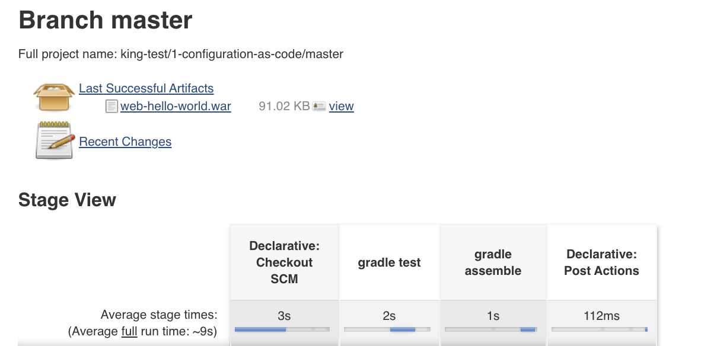

# 1-configuration-as-code

This repo contains web-hello-world code from https://github.com/gradle/oreilly-gradle-book-examples/blob/master/web-hello-world and we just added. 

## Steps to build the code
```
gradle build
```

## Step to run test cases
```
gradle clean tests
```


## Pipeline logs

```
[Pipeline] withEnv
[Pipeline] {
[Pipeline] stage
[Pipeline] { (gradle test)
[Pipeline] script
[Pipeline] {
[Pipeline] sh
+ gradle clean test
> Task :clean
> Task :compileJava
> Task :processResources NO-SOURCE
> Task :classes
> Task :compileTestJava
> Task :processTestResources NO-SOURCE
> Task :testClasses

> Task :test

org.gradle.examples.web.ServletTest > testDoGetServlet STANDARD_OUT
    Result for /hello: hello, world

BUILD SUCCESSFUL in 1s
4 actionable tasks: 4 executed
[Pipeline] }
[Pipeline] // script
[Pipeline] }
[Pipeline] // stage
[Pipeline] stage
[Pipeline] { (gradle assemble)
[Pipeline] script
[Pipeline] {
[Pipeline] sh
+ gradle assemble
> Task :compileJava UP-TO-DATE
> Task :processResources NO-SOURCE
> Task :classes UP-TO-DATE
> Task :war
> Task :assemble

BUILD SUCCESSFUL in 0s
2 actionable tasks: 1 executed, 1 up-to-date
[Pipeline] }
[Pipeline] // script
[Pipeline] }
[Pipeline] // stage
[Pipeline] stage
[Pipeline] { (Declarative: Post Actions)
[Pipeline] junit
Recording test results
[Pipeline] archiveArtifacts
Archiving artifacts
[Pipeline] }
[Pipeline] // stage
[Pipeline] }
[Pipeline] // withEnv
[Pipeline] }
[Pipeline] // node
[Pipeline] End of Pipeline
```

